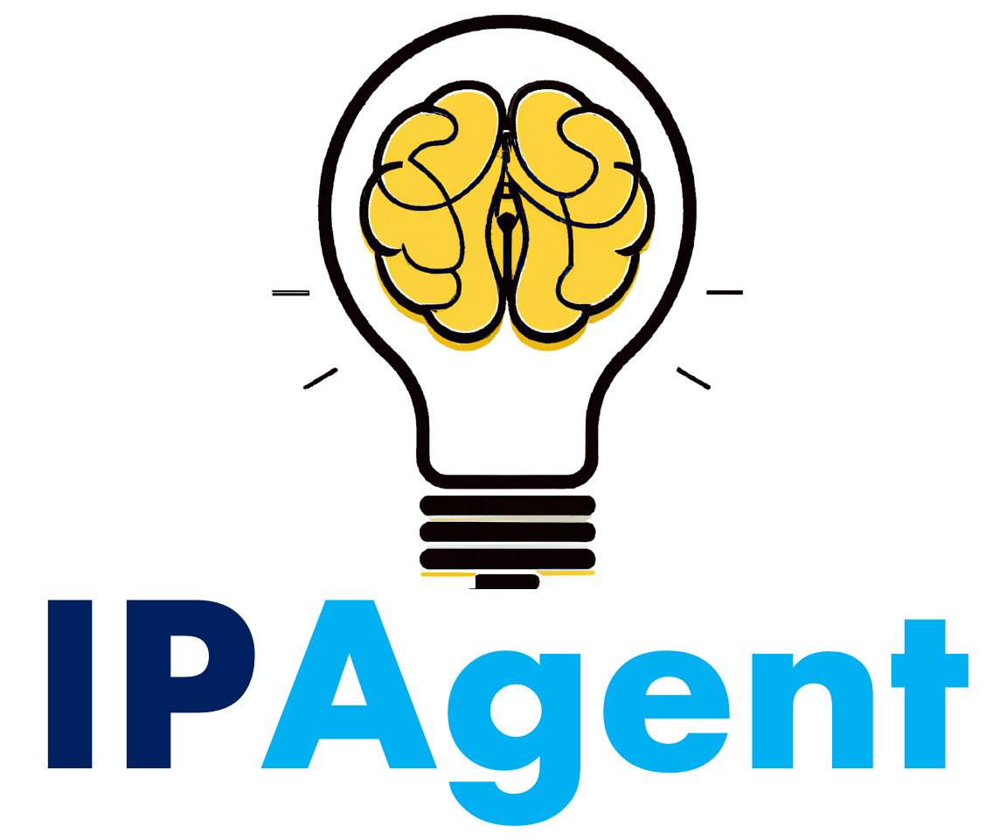
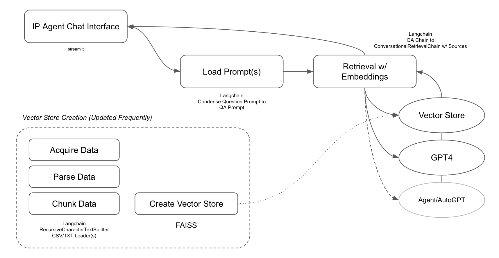

# IPAgent - Patent Landscape Analysis Chatbot



This project is an exploratory chatbot created for the [1871 ChatGPT Hackathon May 6-7, 2023](https://1871.com/event/ai-hackathon/). It aims to create a ChatGPT bot and/or agent that can assist browsing through USTPO patent data, and find areas of overlap in the existing patent landscape when provided new ideas.

More specifically, the hackathon considered two potential high-level approaches to getting context relevant information from ChatGPT via the API:

1. AutoGPT for Searching Google Patents and aggregating results
2. Vectorized database and GPT API as an interpreter

Preliminary tests were run on the first approach using preexisting Agent tools, and it was decided that approach two could yield more relevant results in a faster timeframe (although requires data preparation). The workflow developed looked something like below:



## Instructions for Use

1. **Clone the repo and install python dependencies**. We used a custom version of the st-chat module because the ability to render html inside the chat widget was in a pull request at the time of writing this:

```
git clone mattshax/ipagent
cd ipagent

# ensure python3.X is installed

# you can also install into a virtual env
python3 -m pip install -r requirements.txt

# install the custom st-chat module (this would be good to remove when they merge the PR)
cd modules/st-chat
python3 -m pip install -e .

# install nodejs for the frontend revisions
cd streamlit_chat/frontend
npm install
npm run build
```

2. **Add your openai credentials to the project .env file**:

```
echo OPENAI_API_KEY=youropenaikeyhere > .env
```

3. **Acquire data from USTPO**. The data is provided from [USTPO's bulk data project website here](https://bulkdata.uspto.gov/), under the section "Patent Grant Full Text Data (No Images) (JAN 1976 - PRESENT)" or "Patent Application Full Text Data (No Images) (MAR 15, 2001 - PRESENT)". For this demo app, only a single week of data is downloaded and processed using the instructions below, and the script filters out only abstract text:

```
cd data
wget https://bulkdata.uspto.gov/data/patent/grant/redbook/fulltext/2023/ipg230103.zip
unzip ipg230103.zip

# example of application data
wget https://bulkdata.uspto.gov/data/patent/application/redbook/fulltext/2023/ipa230105.zip
unzip ipa230105.zip
```

4. **Parse the USTPO bulk data xml file to a single format csv file**. We decided to initially use the CSV langchain loader for proof of concept purposes, but as the data scales up better loaders would be preferred. By default the script only parses the first 1000 patents in the file (so the chatbot context has only 1000 patents in it by default - takes about 3-5 minutes to process):

```
python3 01_parse_data.py
```

5. **Create the vector store**. This project uses [FAISS](https://github.com/facebookresearch/faiss) for the vector store. It requires loading the parsed data from the previous step into a langchain CSVLoader, then generating embeddings with openai API. It will provide a cost estimate to create the embeddings:

```
python3 02_create_vector.py
```

6. **Run the application**. The app is built of the [Robby Chatbot](https://github.com/yvann-hub/Robby-chatbot) project as a starting point (uses streamlit as the python-based UI), and customized for the specific goals fo the project:

```
./03_run_app.sh

# navigate to http://localhost:3010
```

This loads the app on port 3010 by default but can be changed in the 03_run_app.sh script.

By default the app loads your OpenAI API key from the .env file. As such, you can optionally add a .creds.yaml file to the project with a username and password to access the app (otherwise it will be open). Restart the application if it is already running:

```
username="admin"
password="yourpassword"

# create the hashed password
cmd="import streamlit_authenticator as stauth; print(stauth.Hasher([\"$password\"]).generate()[0])"
hashedPassword=`python3 -c "$cmd"`

cat > .creds.yaml << END
credentials:
  usernames:
    admin:
      name: $username
      password: $hashedPassword
cookie:
  expiry_days: 30
  key: ipagent
  name: ipagentcookie
END
```

## Acknowledgements

- [Keith Besserud](https://www.linkedin.com/in/keith-besserud-aia-8819006/) (collaborator and teammate on IPAgent hackathon project)
- [1871 Innovation Hub](https://1871.com/) (hosted the hackathon)
- [OpenAI](https://openai.com/) (provided helpful advise and chatgpt4 access)
- [Building of shoulders of others - technologies used or referenced](./SOURCES.md)

## License

IPAgent is MIT-licensed, refer to the LICENSE file in the top level directory.
